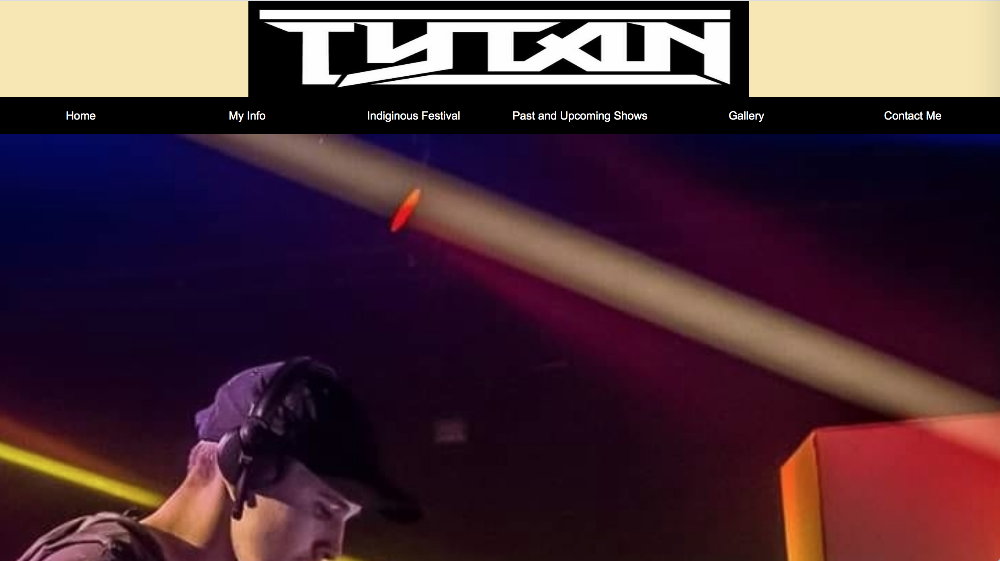
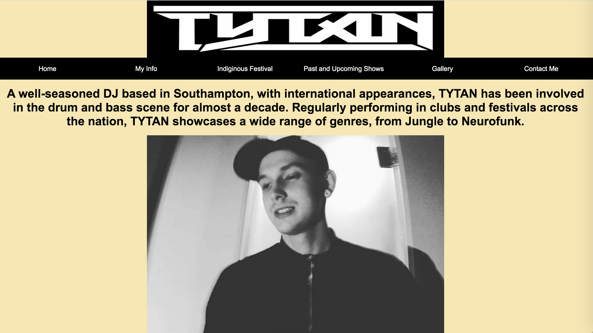
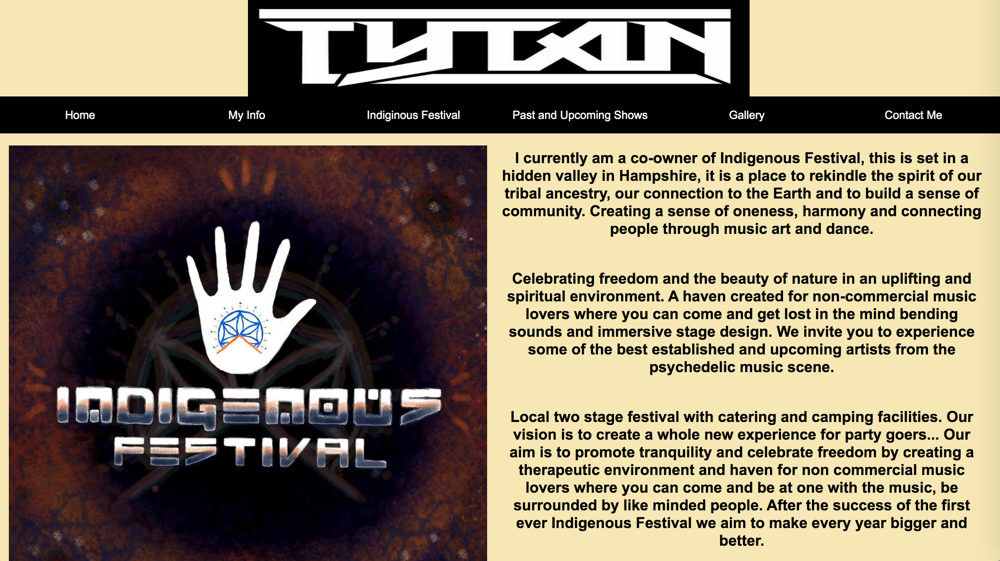
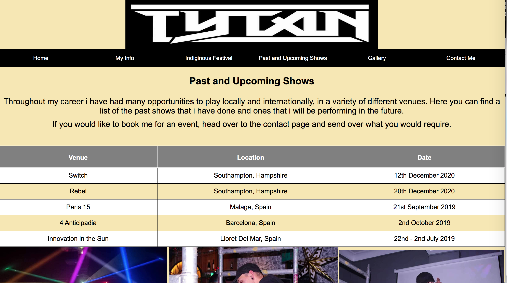
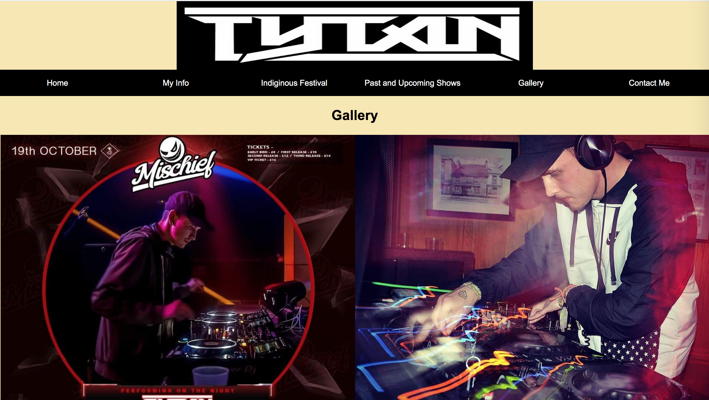
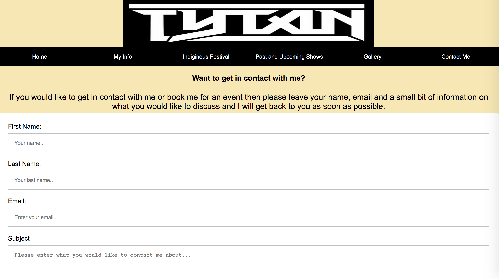
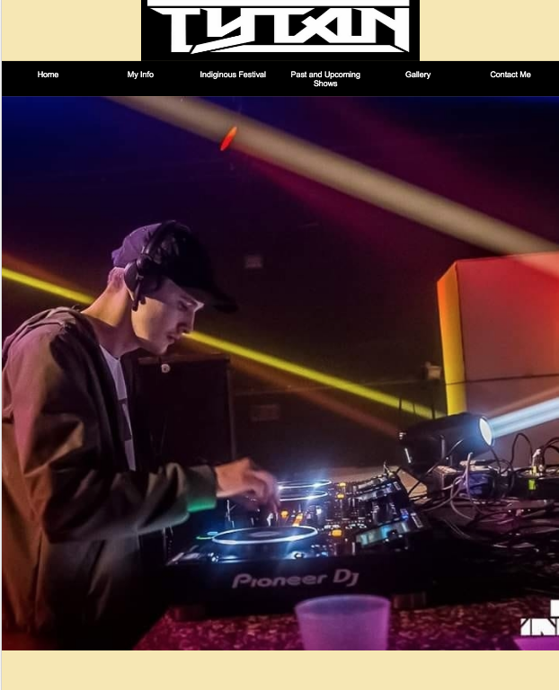
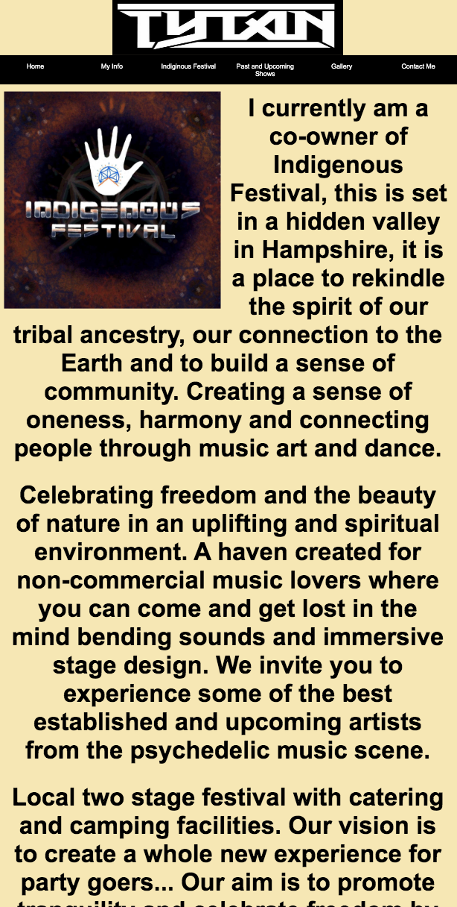
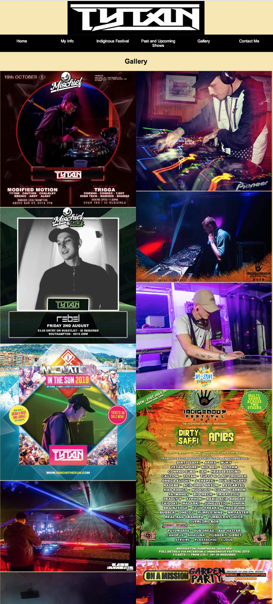

# Tytan-Website 

# Portfolio for an aspiring DJ
  This website was created to help a friend to showcase his work to the public locally and internationally.
  
 # Links
  
  Website: 
  Github: https://github.com/Tylarobson/Tylarobson.github.io
  
 # Install
  npm install and npn run sass-watch
  node moduels packet
  A package.json 
  
  # Style Guide 
  
  HTML: https://www.w3schools.com/html/html5_syntax.asp
  
  CSS: https://google.github.io/styleguide/htmlcssguide.html
  
  Javascript: https://www.w3schools.com/js/js_conventions.asp
  
  
  # Braching Strategy 
  This code will be connected with the master branch which is linked with my github page.
  
  # Testing
  
  When testing this website i wanted to make sure that it runs on all browsers and that everything works on the website such as embeded links, content and images. Also making sure that the website is responsive for desltop and mobile devices.
  
 # Browsers it supports: 
        Google Chrome
        Safari 
        Microsoft Edge
        Firefox 
        
# Desktop 

# Mobile

        
# Problems along the way
There main probelms that occured was some of the images would not load when trying to run the website however with some research this was quickly mended. Also when trying to use float sometimes it would not work but when playing around with it made everything fall into place.

# Reflection 
When looking back at the whole process there are somethings that now i wish i would devlop more, because i lose the ability in myself sometimes it can take a while to get the code and layout right. Also creating the website for a friend took more time than normal as having to talk about the layout and the content of the work. I used HTML, CSS and Javascript to create the website with some guidence from w3schools. Overall i feel that with more time this website could look alot better. 
  
# Conclustion
Overall this project was something of a challenge but i feel that it does showcase that it is a portfolio dj website. However with more CSS i feel that the website could of be styled better.
